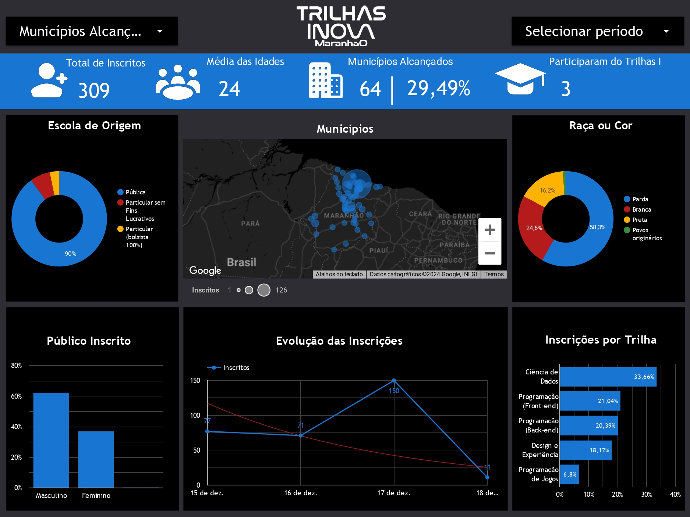
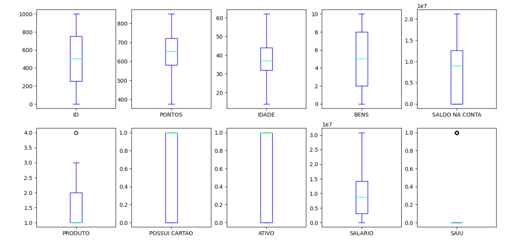

[](README.br.md)
[](README.md)

# Programa Trilhas Inova
O objetivo do Programa Trilhas Inova Maranhão é qualificar pessoas, a partir de 16 anos, em formação tecnológica, nas áreas de programação front-end, programação back-end, programação de jogos, design, análise de dados e carreiras, possibilitando uma visão empreendedora, atendendo as demandas de mão de obra locais, nacionais e
internacionais, fomentando a empregabilidade nas áreas de tecnologia e como consequência, promovendo justiça social.

## Desafios
Desafios feitos para a Trilha de Dados:

* [Desafio 01](https://github.com/franciellerl/Trilhas/tree/main/%2301) (#01)
  * Desafio de 10 questões com foco no aprendizado em JavaScript.
 
* [Desafio 02](https://github.com/franciellerl/Trilhas/tree/main/%2302) (#02)
  * Desafio duo, com metade das questões voltadas para conhecimentos em JavaScript e a metade voltadas para o desenvolvimento do Pensamento Criativo.

* [Desafio 03](https://github.com/franciellerl/Trilhas/tree/main/%2303) (#03)
  * Desafio de desenvolvimento de dashboard, com ênfase na visualização de dados.
 
* Desafio 04
  * Desafio em grupo, houve a criação de um dashboard com informações do projeto proposto pela equipe.
 
* [Desafio 05](https://github.com/franciellerl/Trilhas/tree/main/%2303) (#05)
  * Desafio com foco no tratamento, limpeza e manipulação de dados por meio do Jupyter Notebook.

## Resultados
* 01
````
//Francielle Rodrigues Lindoso - Trilha de Ciência de Dados
//QUESTÃO 1

let nome = prompt("Qual é o seu nome?");
if (nome){
  console.log("Olá, " + nome + ", seja bem-vindo(a) à nossa empresa");
}
else {
  console.log("Desculpe, nenhum nome fornecido!");
}
````

* 03


* 05


## Ferramentas Utilizadas
* Javascript
* Jupyter Notebook
* Google Looker Studio

## Competências Demonstradas
Análise e interpretação de dados, desenvolvimento de dashboards para visualização de informações, tratamento e organização de bases de dados em Jupyter Notebook, além da aplicação de lógica de programação em JavaScript para resolução de problemas.
